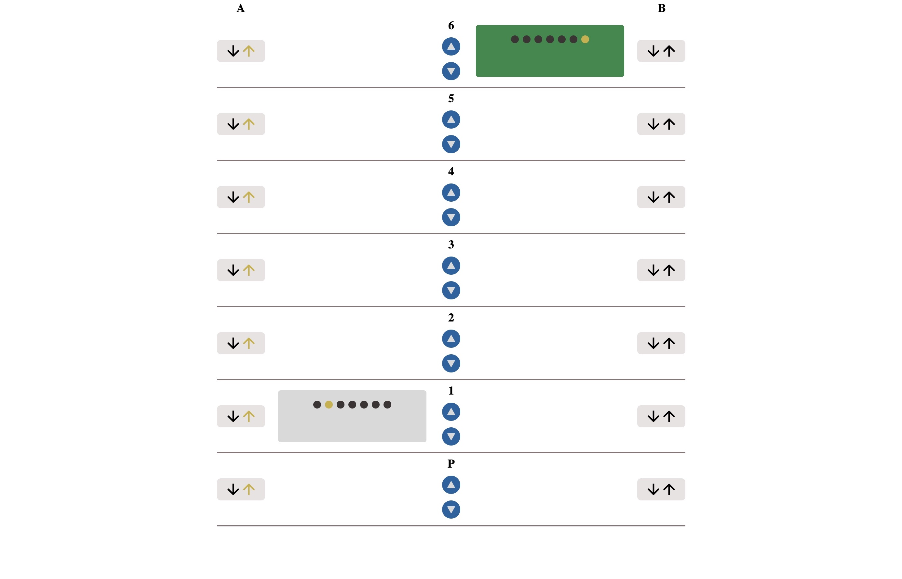
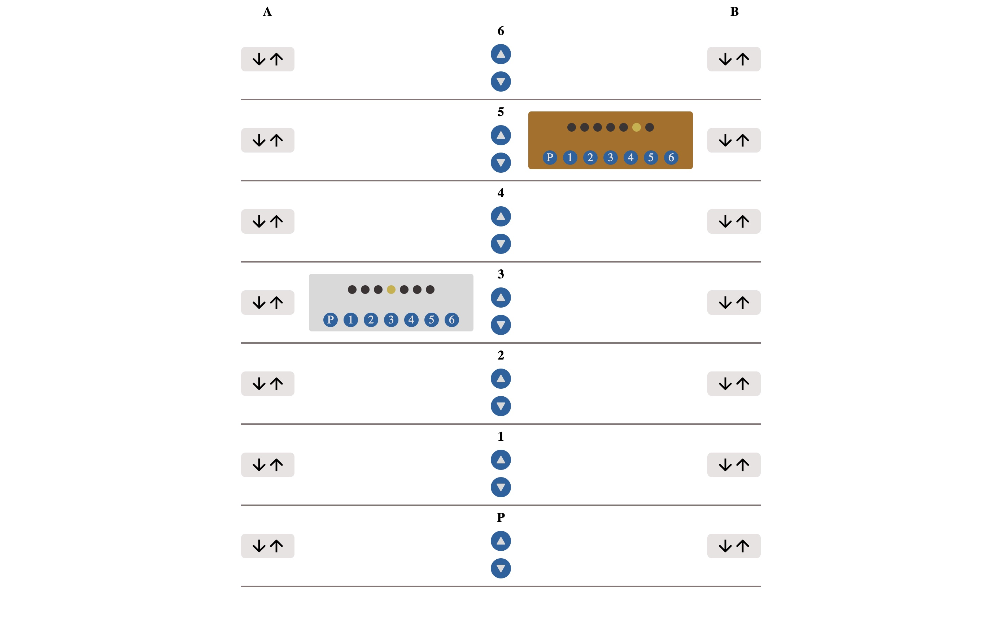

# Elevator

This project implements the lift test, which simulates the mechanism of an elevator system, in a builing with 2 lifts and 7 floors (0-6).

## Description

### Lift Mechanism

This simulation models a building with two lifts located initially on the first (0) and top (6) floors. The lift system intelligently responds to calls from floors, seamlessly moving between them. Each lift can exist in different states, including:

- **Available:** Ready to serve calls.
- **In Function and Moving:** Actively in transit between floors.
- **Waiting for Destination Selection:** Paused on a floor, awaiting user input.
- **Alerted:** Triggered when no destination is selected within 5 seconds of a call, returning to availability after an additional 3 seconds.

### Floor & Lift Interactions

On each floor, users interact with lifts using clear up and down buttons. Real-time indicators provide visibility into lift movements, ensuring users are informed. Inside each lift, a control panel displays the current location and allows users to select destinations. Destination selection is only enabled when the lift arrives at the called floor.

A unique feature triggers an alert state when a lift is called without a destination. After 5 seconds, the lift enters an alert state and becomes available again after an additional 3 seconds.

<div style="display: flex; justify-content: space-between;">
  <div style="flex: 1;">
    

  </div>
  <div style="flex: 1; margin-left: 20px;">
    

  </div>
</div>

<br/>

# Implementation Overview

In implementing this project, various technologies were utilized to ensure a robust system.

The backend, powered by **Node.js**, incorporates **TypeScript** and the **Express framework** for efficient handling of HTTP requests and backend logic. On the frontend, **React** is applied alongside **TypeScript** to create responsive and interactive user interfaces.

For seamless communication between components, the project employs distinct protocols. The **REST API** is utilized for user interactions, such as calling lifts and selecting destinations, providing a standardized approach for data exchange between the client and server. Real-time updates for lift status changes are facilitated through **WebSocket** communication. This enables the server to notify the client efficiently.

This combination of technologies and communication protocols ensures a dynamic and responsive user experience.

## Getting Started

Follow these steps to set up and run the project locally on your machine.

### Prerequisites

Ensure that you have the following software installed on your system:

- [Node.js](https://nodejs.org/) (version 20.9.0 or higher)
- [npm](https://www.npmjs.com/) (usually comes with Node.js)

### Installation

To run this project locally, follow these steps:

1. **Clone the repository:**

   ```bash
   git clone https://github.com/NedaAgi/elevator.git
   ```

2. **Navigate to the project directory:**

   ```bash
   cd elevator
   ```

3. **Install dependencies for the server:**

   ```bash
   cd app
   npm install
   ```

4. **Install dependencies for the client:**

   ```bash
   cd ../client
   npm install
   ```

### Running the Application

To run the full application locally, you'll need to start both the server and the client.

#### Server

```bash
# Navigate to the app(server) directory
cd app

# Run the server
npm start

```

#### Client

```bash
# Navigate to the client directory
cd client

# Run the client
npm start
```

### Accessing the Application

After successfully starting the server and client, open your web browser and visit http://localhost:3000 to access the full application locally. You should now be able to interact seamlessly.

For direct access to the server, use the URL http://localhost:5000/.
